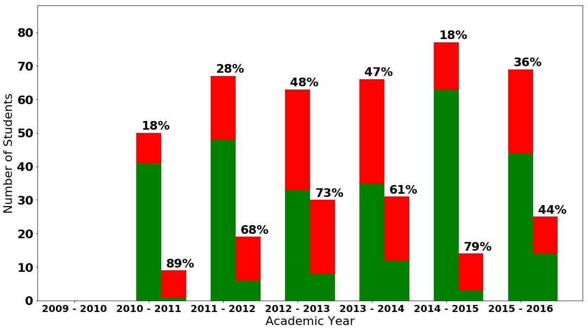
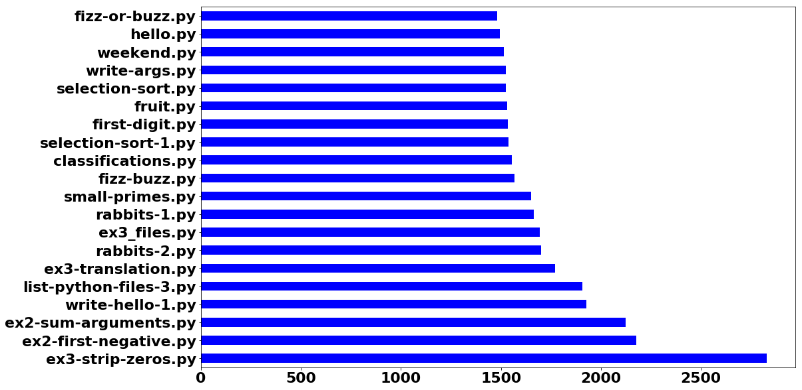
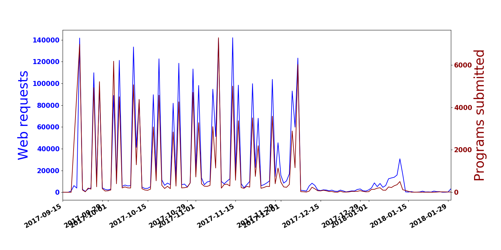

# Educational Data Mining Predictive Modeling for Student Data

This repo presents a new research methodology to automatically detect *students at-risk* of failing a computer-based examination in computer programming modules (courses). By leveraging historical student data, we built predictive models using students' offline (**static**) resources including student characteristics and demographics, and online (**dynamic**) resources using programming and behavioural logs. Predictions are generated weekly during semester and evaluated afterwards.

## Technologies

* Python
* [numpy](https://www.numpy.org/)
* [scipy](https://www.scipy.org/)
* [Pandas](https://pandas.pydata.org/)
* [Matplotlib](https://matplotlib.org/)
* [scikit-learn](https://scikit-learn.org/)
* [Jupyter](https://jupyter.org/)

## Code

1. Data Collection: 
   * Programming work
   * Web interactions & events
   * [Demographics](src/notebooks/1.%20Data%20Collection.%20Extracting%20demographics.ipynb)
   * Academic grades
2. Exploratory Data Analysis:
   * [Programming work](src/notebooks/2.%20EDA.%20Exploring%20Programming%20work.ipynb)
   * [Web interactions & events](src/notebooks/2.%20EDA.%20Exploring%20Web%20data.ipynb)
   * [Programming + Web](src/notebooks/2.%20EDA.%20Exploring%20Web%20%26%20Programming's%20activity.ipynb)
   * [Demographics](src/notebooks/2.%20EDA.%20Exploring%20Demographics.ipynb)
   * [Academic grades](src/notebooks/2.%20EDA.%20Exploring%20Academics.ipynb)

You can always view a notebook using https://nbviewer.jupyter.org/

## Deployment

### Virtual Environment using Bash

1. Creation of a virtual environments done by executing the command venv
2. Command to activate virtual environment
3. Install dependencies
4. List the libraries installed on your environment
5. Do your work!
6. When you are done, the command to deactivate virtual environment
```
$ python3 -m venv env/
$ source env/bin/activate
(env) $ pip install -r requirements.txt
(env) $ pip freeze
(env) $ jupyter notebook
(env) $ ...
(env) $ deactivate
```

## Figures

**Exploring Passing & Failing Rates for CA114:**


**Exploring the TOP 20 most-submitted tasks:**


**Exploring Programming & Web activity on 2017/2018 academic year:**

